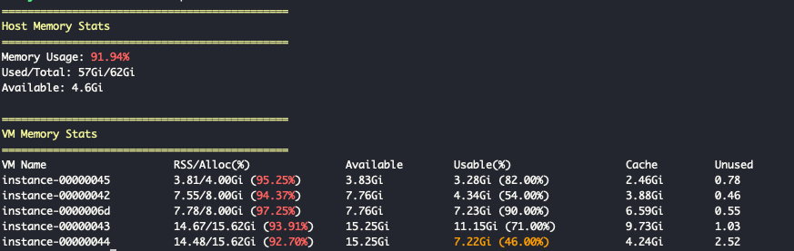

# host-vm-memory-checker

## 소개

호스트 메모리 상태와 KVM 기반 가상머신의 메모리 사용량을 보여주는 도구입니다.  
가상머신을 여러대 설치하다보면 우리도 모르게 메모리를 많이 사용하게 됩니다. 이 도구를 활용하여 호스트와 가상 머신의 메모리 사용량을 한번에 확인할 수 있으며 색을 통해 메모리 부족 여부를 확인할 수 있습니다.

## 실행 방법

```bash
# script.sh에 실행 권한을 준다.
chmod +x script.sh

# 루트 권한으로 실행시킨다.
sudo ./script.sh
```

## 실행 결과

> [!NOTE]  
> 구체적인 결과값은 [metrics 문서](./docs/metrics.md)를 참고하시길 바랍니다.


